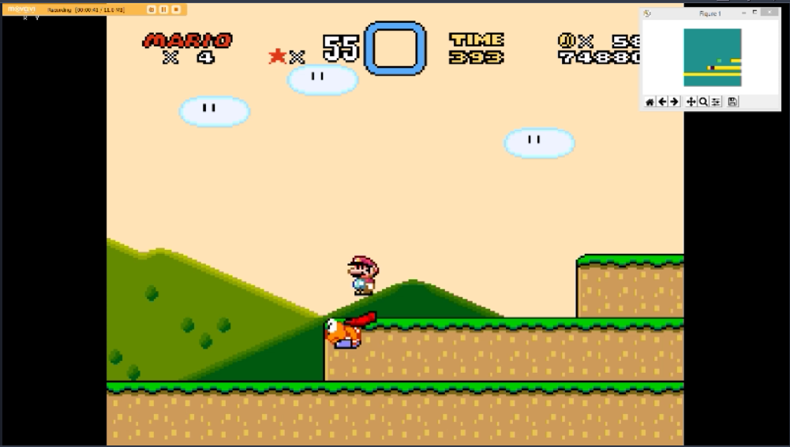

# SuperMarioWorld_env

This is an openaigym SuperMarioWorld environment for reinforcement learning. It is compatible with OpenAI Stable Baselines for testing different algorithms and hyperparameters. 

Below is the results of ~2.5mil training steps using the PPO algorithm, where it beats Donut Plains 1.
https://www.youtube.com/watch?v=wY0yuxa_1pA

REQUIREMENTS:
  1. Bizhawk-2.3.1
  2. A SuperMarioWorld romhack
  3. Lua Sockets
  4. Lua JSON
  5. gym
  6. OpenAI Stable Baselines
  7. Python-3.6

RUNNING 

Running as a general gym env:
 1. Open Bizhawk. 
 2. Run SuperMarioWorld rom in Bizhawk
 3. Import MarioEnv from mario-v0.py file to use as an openaigym env
 4. Open Bizhawk>Tools>LuaConsole
 5. Paste .lua file in the LuaConsole.

Running with PPO:
 1. Open Bizhawk. 
 2. Run SuperMarioWorld rom in Bizhawk
 3. Run run.py in command line. This is simply a wrapper for OpenAI Stable Baselines PPO code.
      a. (Optional) add -l rl_model_2milsteps to command line to load the pre trained file.
      b. (Optional) add -eval to command line to evaulate the model
 4. Open Bizhawk>Tools>LuaConsole
 5. Paste .lua file in the LuaConsole.

To run on another level, create a new level.State save file in Bizhawk and save in your working directory.

 
 
PROJECT DESCRIPTION

Observations Space:
1. The inputs were taken from Seth Bling's MARI/O project, with slight modifications.
2. The Observation space is 17x17 grid created using RAM inputs.
3. Input Values: 1 = tile, 0=background, 0.5=Mario Sprite, -1=Enemy Sprites, -0.5=Enemy projectiles

  

Action Space:
1. The action space is simplified to four inputs, 'A', 'B', Left', 'Right'

Reward Function:
0. The reward (r) function is loosely based off the gym-super-mario-bros library. 

1. v = RAM reading of Mario's velocity / 50. (max reward = 1 per step). 
2. c = level complete. (reward = 15). 
3. d = death or timeout. (reward = -15). 
5. h = platform height bonus, if Mario jumps on a platform. (max reward = 0.1 per step). 

5. r = v+c+d+h

